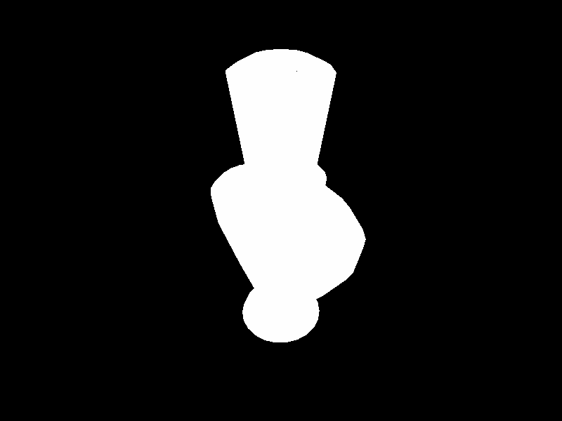
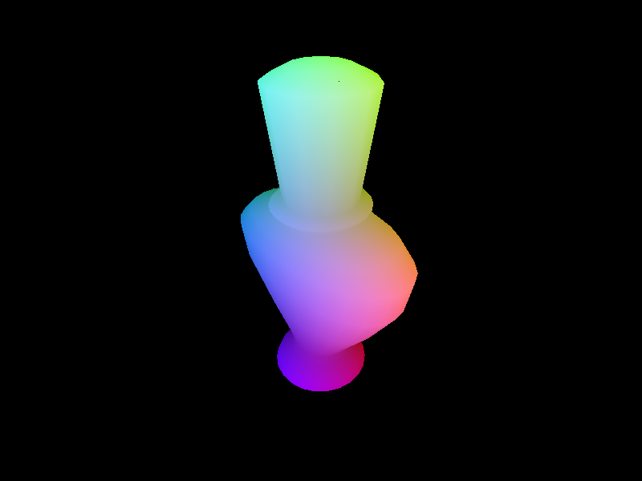
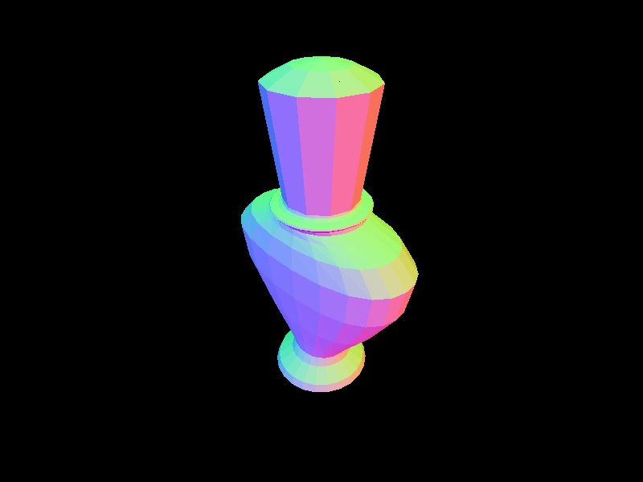
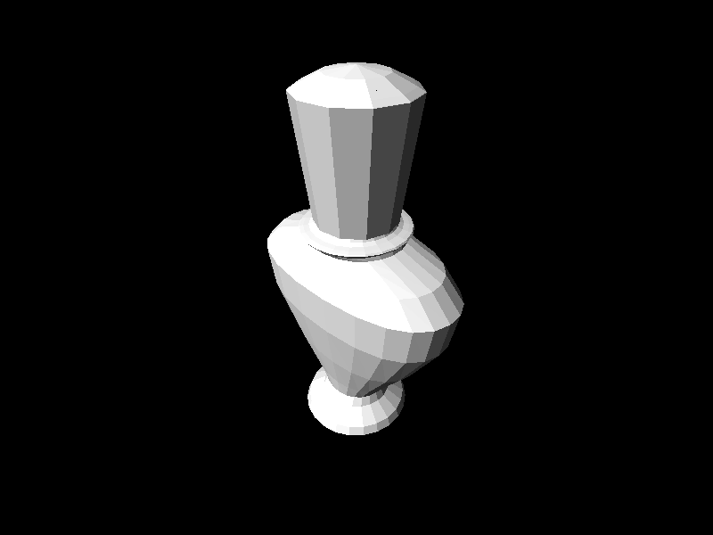

# rendirt

*rendirt* is a bare-bones C++ software rendering library for triangle meshes.
The library is able to load STL models both in binary and ASCII format.
In fact, offline rendering of STL model thumbnails is its primary use case.
From this point of view, *rendirt* means *render it*.

**But beware!** *rendirt* also stands for *dirty renderer*. This thing is as
simple as possible, quite inflexible and completely unoptimized. Clocking in
at ~500 lines of code, it does its (very limited) work in reasonable time and
that's all. This is not meant to be an example of good practice in graphics
programming. Decent speed is only achieved with optimizations enabled. Still,
the debug build manages to render ~400k tris at 800x600 px in about 1 second
and simpler models in less than half a second. It becomes orders of magnitude
faster when compiler-optimized. *(DISCLAIMER: those are not accurate measures,
just an average execution time to give an idea)*.

The renderer implements a fixed-pipeline vertex processor with optional
face culling (enabled by default) and a programmable fragment shader.
The fragment shader function has access to fragment position and depth,
interpolated object-space position and normal. Some predefined shaders are
provided.

The wonderful [glm](https://glm.g-truc.net/0.9.9/index.html) library is used
extensively. Headers for its 0.9.9.2 version are included in the repository,
but any other recent version will do. The license can be found [below](#glm).

## Building

*rendirt* uses the meson build system for peace of mind. This is not strictly
necessary since the project consists of [a single header](rendirt.hpp)
(`rendirt.hpp`) and a [single source file](rendirt.cpp) (`rendirt.cpp`) which
can be compiled directly by any C++11 conformant compiler, provided *glm* is
available in the include path.

To build the *rendirt* static library and examples:
```sh
$ meson build && ninja -C build
```

To use the release configuration (optimized binaries):
```sh
$ meson build --buildtype=release && ninja -C build
```

If you can't use *meson* or prefer not to, compiling and linking each *cpp*
file from the [examples folder](examples) together with `rendirt.cpp` will
do the trick.

## It works!

The `render` example will load the given STL model and save the rendered image
as `render.tiff` in the current directory:
```sh
$ build/examples/render path/to/file.stl
```

The `animation` example requires SDL2. It will load the given model and
display an animated view. Various parameters can be tweaked by pressing keys,
see command output for instructions. Decent frame rates can be achieved only
with the release build (with optimization enabled).
```sh
$ build/examples/animation path/to/file.stl
```

Interesting test models can be downloaded
[here](http://people.sc.fsu.edu/~jburkardt/data/stla/stla.html). They're not
included in this repository because of size and licensing.

Four sample renders, one for each predefined shader, are included in folder
[examples/images](examples/images).

### Depth shader



### Position shader



### Normal shader



### Diffuse directional lighting shader



## Documentation

Please read the [header](rendirt.hpp) and [examples](examples) for now, they're
short and not very complicated. I'll add some documentation as soon as I have
time and feel like it (that may easily mean never, though).

## License

*rendirt* is distributed under the MIT license.

Copyright (c) 2018 Fabio Massaioli

Permission is hereby granted, free of charge, to any person obtaining a copy
of this software and associated documentation files (the "Software"), to deal
in the Software without restriction, including without limitation the rights
to use, copy, modify, merge, publish, distribute, sublicense, and/or sell
copies of the Software, and to permit persons to whom the Software is
furnished to do so, subject to the following conditions:

The above copyright notice and this permission notice shall be included in all
copies or substantial portions of the Software.

THE SOFTWARE IS PROVIDED "AS IS", WITHOUT WARRANTY OF ANY KIND, EXPRESS OR
IMPLIED, INCLUDING BUT NOT LIMITED TO THE WARRANTIES OF MERCHANTABILITY,
FITNESS FOR A PARTICULAR PURPOSE AND NONINFRINGEMENT. IN NO EVENT SHALL THE
AUTHORS OR COPYRIGHT HOLDERS BE LIABLE FOR ANY CLAIM, DAMAGES OR OTHER
LIABILITY, WHETHER IN AN ACTION OF CONTRACT, TORT OR OTHERWISE, ARISING FROM,
OUT OF OR IN CONNECTION WITH THE SOFTWARE OR THE USE OR OTHER DEALINGS IN THE
SOFTWARE.

### glm

*glm* files are distributed under the MIT license.

Copyright (c) 2005 - G-Truc Creation

Permission is hereby granted, free of charge, to any person obtaining a copy
of this software and associated documentation files (the "Software"), to deal
in the Software without restriction, including without limitation the rights
to use, copy, modify, merge, publish, distribute, sublicense, and/or sell
copies of the Software, and to permit persons to whom the Software is
furnished to do so, subject to the following conditions:

The above copyright notice and this permission notice shall be included in all
copies or substantial portions of the Software.

THE SOFTWARE IS PROVIDED "AS IS", WITHOUT WARRANTY OF ANY KIND, EXPRESS OR
IMPLIED, INCLUDING BUT NOT LIMITED TO THE WARRANTIES OF MERCHANTABILITY,
FITNESS FOR A PARTICULAR PURPOSE AND NONINFRINGEMENT. IN NO EVENT SHALL THE
AUTHORS OR COPYRIGHT HOLDERS BE LIABLE FOR ANY CLAIM, DAMAGES OR OTHER
LIABILITY, WHETHER IN AN ACTION OF CONTRACT, TORT OR OTHERWISE, ARISING FROM,
OUT OF OR IN CONNECTION WITH THE SOFTWARE OR THE USE OR OTHER DEALINGS IN THE
SOFTWARE.
